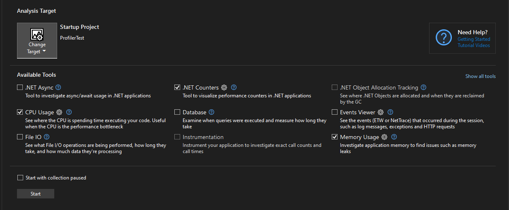
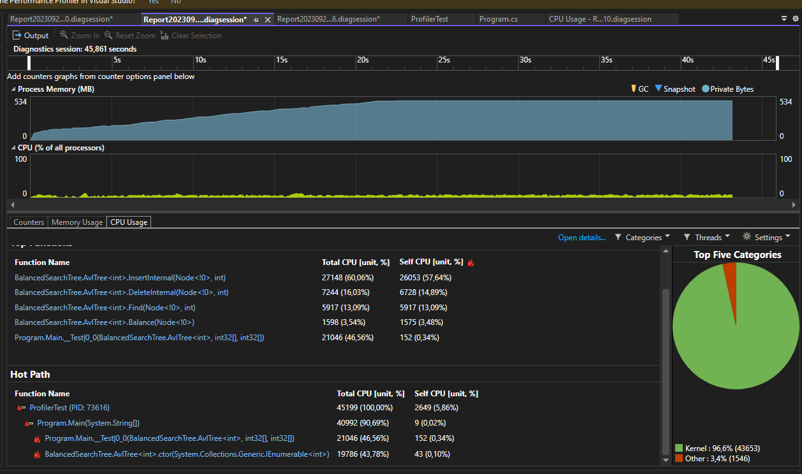
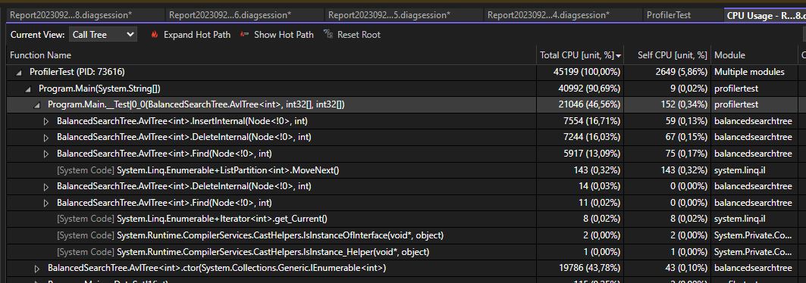

### Run Profiler

I tested ProfilerTest.csproj with Performance Profiler in Visual Studio. It is a console app that initializes AvlTree with a certain number of elements, and then performs Insert, Delete and Find operations 10M times.

I ran it with different input size (passed as command line argument) with these parameters:

### Results

| Insert   | Delete   | Find     | Input Size       | log(n, 2) | Memory(MB)|
| -------- | -------- | -------- | ---------------- | --------- | -------   |
| 1,435    | 1,381    | 1,020    | 1,000            | 10        | 16        |
| 2,006    | 1,975    | 1,548    | 10,000           | 13        | 17        |
| 2,844    | 2,806    | 2,253    | 100,000          | 17        | 28        |
| 5,259    | 5,075    | 4,207    | 1,000,000        | 20        | 67        |
| 7,554    | 7,244    | 5,917    | 10,000,000       | 23        | 485       |
| 11,794   | 11,083   | 9,087    | 100,000,000      | 27        | 4,500     |

